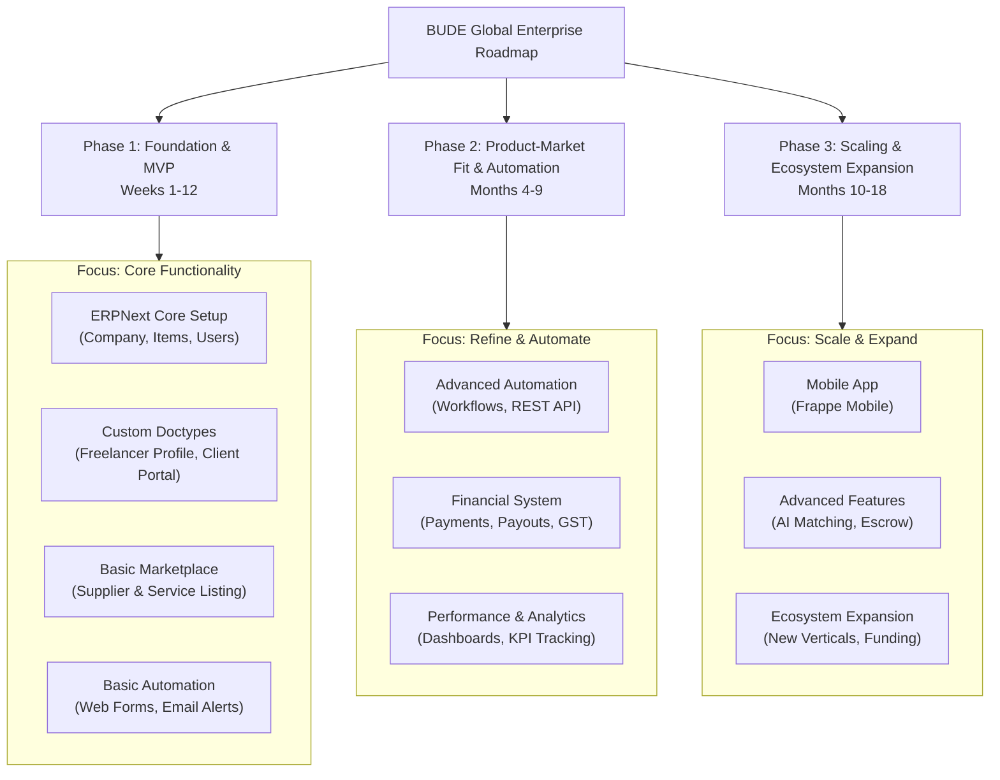

# **BUDE Global Enterprise** using **ERPNext** and the **Frappe Framework**.

This roadmap is divided into three distinct phases, focusing on building a Minimum Viable Product (MVP), achieving Product-Market Fit, and then scaling into a full-fledged platform.

### **Phase 1: The Foundation & MVP (Months 1-3)**
**Goal:** Establish a fully functional system for managing your own freelance projects and a basic, manual marketplace.

#### **Month 1: Core ERPNext Setup & Customization**
1.  **ERPNext Installation & Configuration**
    *   Install ERPNext on a VPS (Vultr, DigitalOcean).
    *   Set up Company master: BUDE Global Enterprise.
    *   Configure domains: `budeglobal.in` (main site), `marketplace.budeglobal.in` (portal).
    *   Set up Email Domain and enable Email API for communications.

2.  **Master Data Setup**
    *   **Items:** Create all services as Stockless Items. Code: `SVC-WEB-DEV`, Group: `IT Services`, UoM: `Hour`.
    *   **Price Lists:** Create `Standard Selling`, `Freelancer Buying`.
    *   **Customer Groups:** `Enterprise`, `Startups`, `Individuals`.
    *   **Supplier Groups:** `Web Developers`, `Designers`, `Writers`.

3.  **Basic Custom Doctypes (Frappe Framework)**
    *   **Freelancer Profile:** A custom doctype extending `User` with fields: `Skills` (Table), `Portfolio_Link`, `Experience_Level`, `Hourly_Rate`, `Availability`.
    *   **Client Profile:** Extends `Customer` with fields: `Industry`, `Preferred_Communication`, `Project_History`.
    *   **Service Listing:** A custom doctype for marketplace listings, linked to `Item` and `Freelancer Profile`.

#### **Month 2: Portal Development & Workflow Design**
1.  **Frappe Website Portal Customization**
    *   Build two separate portals:
        *   **Client Portal:** To view projects, quotes, invoices, and send messages.
        *   **Freelancer Portal:** To manage profile, view assigned tasks, log time, and see earnings.
    *   Use **Web Forms** for:
        *   Client Lead Capture / Contact Us forms.
        *   Freelancer Application Form (this creates a `Freelancer Profile` doc).

2.  **Core Workflow Automation**
    *   **Client Lead to Quote:** Lead -> Opportunity -> Quotation (auto-generated from Opportunity).
    *   **Project Execution:** Quotation -> Sales Order -> Project -> Task -> Time Log -> Invoice.
    *   **Freelancer Payout:** Time Log -> Purchase Invoice -> Payment Entry.
    *   Use **ERPNext Auto Email Reports** to send daily digest to yourself: New Leads, Overdue Invoices, Pending Tasks.

#### **Month 3: MVP Launch & Manual Operations**
1.  **Go Live with Basic Marketplace**
    *   Manually onboard 5-10 trusted freelancers. You will act as the intermediary.
    *   List their services on a dedicated marketplace page on your site.
    *   All client communication and payment flows through you. You handle matching freelancers to projects manually.

2.  **Initial Process Refinement**
    *   Document every bottleneck.
    * Get feedback from initial clients and freelancers on the portal experience.
    *   Begin drafting specs for Phase 2 automation.

---

### **Phase 2: Product-Market Fit & Automation (Months 4-9)**
**Goal:** Reduce your manual intervention by 80%. The system should automatically handle matching, onboarding, and payments.

#### **Months 4-6: Automation Engine**
1.  **Advanced Workflows & Notifications**
    *   Automate freelancer onboarding: `Web Form -> Freelancer Profile -> Notification to Admin -> Approve -> Auto-create User & Supplier`.
    *   Set up **ERPNext Assignment Rules** to auto-assign tasks (like reviewing applications) to yourself.

2.  **REST API Integration**
    *   Integrate **WhatsApp Business API** via Frappe REST API for sending project updates, payment alerts, and lead follow-ups.
    *   Integrate **Payment Gateway** (Razorpay) for online payments. Auto-reconcile payments with invoices.
    *   Build an API endpoint for freelancers to pull their project details into their own systems.

3.  **Financial Automation**
    *   Set up **Auto-invoicing** upon Sales Order submission.
    *   Set up **Payment Terms** for automatic reminders.
    *   Configure **GST** and **TDS** rules to auto-calculate on invoices.

#### **Months 7-9: Data & Decision Making**
1.  **Advanced Reporting & Dashboards**
    *   Build a **Manager Dashboard** with widgets:
        *   Project Pipeline (Lead -> Opportunity -> Quotation -> Won)
        *   Freelancer Utilization Rate (Hours Logged / Hours Available)
        *   Client Profitability (Revenue vs. Freelancer Payout)
        *   Marketplace Health (New Signups, Active Listings)
    *   Use **Frappe Charts** to visualize this data on custom desk pages.

2.  **Quality & Performance Systems**
    *   Create a **Rating & Review** system (custom doctype) linked to Projects and Freelancers.
    *   Implement a **KPI system** for freelancers: On-time delivery, Client rating, Communication score.
    *   Use this data to build an **auto-matching algorithm** that suggests the best freelancer for a new project.

---

### **Phase 3: Scaling & Ecosystem Expansion (Months 10-18)**
**Goal:** Transition from a service-based agency to a scalable, multi-vendor platform.

#### **Months 10-12: Platformification**
1.  **Self-Serve Marketplace**
    *   Develop a fully automated **Freelancer Onboarding** workflow with document signing (e.g., DocuSign integration).
    *   Build a **Escrow Payment System**: Client pays to escrow on project start, funds are released to freelancer upon milestone completion.
    *   Implement a **commission model** in your pricing (e.g., add a 15% platform fee on top of freelancer's rate).

2.  **Mobile App**
    *   Use **Frappe Mobile** to build a white-label mobile app for freelancers to log time, chat, and manage tasks.
    *   Build a separate client app for project tracking.

#### **Months 13-18: Expansion & Monetization**
1.  **New Verticals**
    *   Duplicate the marketplace model for new service categories: `Virtual Assistants`, `Digital Marketing`, `IoT Consultants`.
    *   Create **Partner Programs** for agencies to onboard their teams.

2.  **Advanced Features**
    *   **AI-Based Matching:** Use Frappe's ML capabilities to auto-match projects and freelancers.
    *   **Subscription Plans:** Offer freelancers "Premium Listings" and clients "Unlimited RFQs" via monthly subscriptions.
    *   **Knowledge Hub:** Sell courses and certifications to freelancers to improve their skills and visibility.

3.  **Fundraising & Team Building**
    *   Your data from ERPNext (growth metrics, revenue, profitability) becomes your pitch deck for raising seed funding.
    *   Hire your first employees: A Frappe developer to maintain the system and a salesperson to onboard clients.

### **Technology Stack Summary**

| Layer | Technology |
| :--- | :--- |
| **Framework** | Frappe Framework |
| **ERP** | ERPNext |
| **Hosting** | VPS (Ubuntu) or Frappe Cloud |
| **Database** | MariaDB |
| **Background Jobs** | Redis & Celery |
| **Frontend** | Frappe JS, Bootstrap |
| **Mobile** | Frappe Mobile (React Native) |
| **Payments** | Razorpay, Stripe |
| **Communications** | WhatsApp Business API, Twilio |
