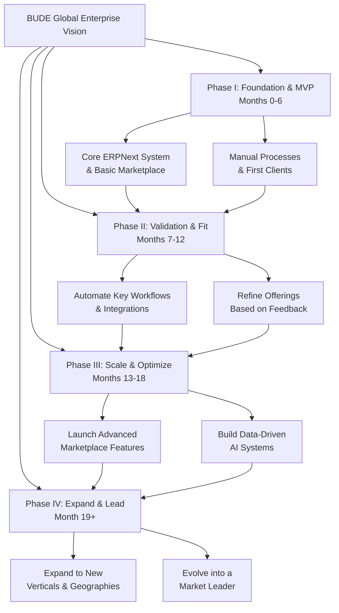

Of course. Based on our extensive discussion, here is a comprehensive, full-fledged roadmap for **BUDE Global Enterprise**, integrating your service offerings, marketplace vision, and technical stack into a phased, actionable plan.

This roadmap visualizes the strategic journey from a foundational solopreneur operation to a scalable, multi-faceted platform.

### **Phase I: Foundation & MVP (Months 0-6)**
**Theme:** Build the core, serve first clients manually, and validate the demand.

**Objectives:**
1.  Establish the core ERPNext system for internal use.
2.  Develop a basic, manually-operated marketplace.
3.  Onboard first 10 paying clients and 20-30 vetted freelancers/suppliers.

**Key Initiatives & Deliverables:**

| Initiative | Description | Key Deliverables |
| :--- | :--- | :--- |
| **1. Core System Setup** | Configure ERPNext as the operational backbone. | - Company, Item, Price List master data. - Custom Doctypes: `Freelancer Profile`, `Client Profile`. - Basic accounting & invoicing setup. |
| **2. Basic Marketplace Portal** | Build the initial version of the marketplace on Frappe. | - Supplier/Freelancer registration web form. - Public service listing pages. - Simple RFQ capture form. |
| **3. Service Delivery Engine** | Standardize how you deliver your own services (ERPNext, IoT). | - Documented SOPs for implementation. - Project templates in ERPNext. - Quote-to-Invoice workflow. |
| **4. Initial Community Building** | manually recruit first users. | - 20-30 approved freelancers/suppliers. - 10 pilot clients for services/marketplace. - Initial testimonials and case studies. |

**Success Metrics:**
*   Revenue: ₹ 5-10 Lakhs
*   Active Clients: 10
*   Marketplace Users: 50

---

### **Phase II: Product-Market Fit & Automation (Months 7-12)**
**Theme:** Systematize operations. Reduce manual effort. Find what works and double down.

**Objectives:**
1.  Achieve 80% automation in lead-to-cash and onboarding processes.
2.  Define and validate a clear value proposition for the marketplace.
3.  Establish predictable lead generation.

**Key Initiatives & Deliverables:**

| Initiative | Description | Key Deliverables |
| :--- | :--- | :--- |
| **1. Automation Engine** | Implement workflows and integrations to reduce manual tasks. | - Automated Freelancer onboarding workflow. - WhatsApp/Email alerts for tasks & payments. - Payment Gateway (Razorpay) integration. |
| **2. Marketplace V2** | Enhance the platform based on early feedback. | - Escrow payment system for trust. - Rating & review system. - Advanced search & filters. |
| **3. Sales & Marketing Engine** | Systematize client acquisition. | - SEO-optimized service pages. - Case study library. - Targeted digital ads (Google/LinkedIn). |
| **4. Data-Driven Decisions** | Implement basic analytics. | - Manager Dashboard in ERPNext. - KPI tracking: Utilization, CAC, LTV. - Monthly financial review process. |

**Success Metrics:**
*   Monthly Recurring Revenue (MRR): ₹ 2+ Lakhs
*   Reduced client onboarding time by 50%.
*   100+ active marketplace users.

---

### **Phase III: Scale & Optimize (Months 13-18)**
**Theme:** Scale what works. Invest in technology and brand.

**Objectives:**
1.  Scale client acquisition.
2.  Launch a mobile app to increase engagement.
3.  Build a dedicated team.

**Key Initiatives & Deliverables:**

| Initiative | Description | Key Deliverables |
| :--- | :--- | :--- |
| **1. Mobile Experience** | Take the platform mobile. | - Frappe-based mobile app for freelancers (time logging, messages). - Client app for project tracking. |
| **2. Advanced Tech Stack** | Upgrade infrastructure and capabilities. | - Kubernetes for deployment scalability. - Advanced BI tool (Metabase) for analytics. - AI-based freelancer-client matching prototype. |
| **3. Team Building** | Hire your first key employees. | - Hire a full-time Frappe Developer. - Hire a Business Development Manager. - Define roles & responsibilities. |
| **4. Brand Building** | Establish thought leadership. | - Speak at industry webinars/events. - Publish whitepapers on digital transformation for SMEs. |

**Success Metrics:**
*   Team Size: 5-10 employees.
*   MRR Growth: 20% Month-over-Month.
*   App Downloads: 1000+

---

### **Phase IV: Expansion & Leadership (Month 19+)**
**Theme:** Expand into new verticals and geographies. Become a market leader.

**Objectives:**
1.  Expand service offerings and geographic reach.
2.  Explore fundraising for aggressive growth.
3.  Evolve into a platform company.

**Key Initiatives & Deliverables:**

| Initiative | Description | Key Deliverables |
| :--- | :--- | :--- |
| **1. New Verticals** | Replicate the model in new domains. | - Launch `BUDE Agri` for farmers. - Launch `BUDE Edu` for educational institutes. |
| **2. Geographic Expansion** | Move beyond initial region. | - Sales teams in 2-3 new Indian cities. - Explore entry into SEA markets (e.g., Vietnam, Indonesia). |
| **3. Fundraising & Partnerships** | Fuel growth with capital. | - Create a detailed investor pitch deck. - Secure Pre-Series A funding. - Form strategic tech partnerships. |
| **4. Platform Ecosystem** | Become an indispensable platform. | - Launch a premium subscription model. - Offer embedded financing for SMEs. - Build an API ecosystem for 3rd party integrations. |

**Success Metrics:**
*   Valuation: $10M+
*   Serving 1000+ SMEs.
*   Recognized as a Top 10 ERPNext partner in APAC.

This roadmap is ambitious but achievable. The key is to stay focused on **Phase I**, validate your assumptions with real clients, and use that learning to fuel the next phases. Good luck! 🚀