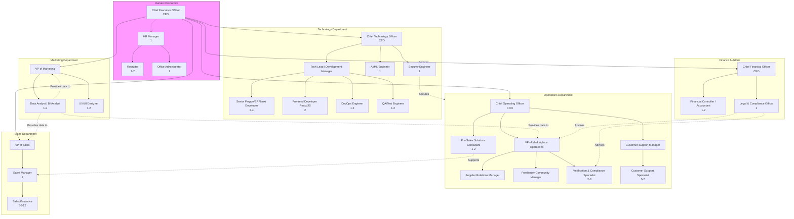

### **BUDE Global Enterprise: Team (Complete Structure)**

| Role Name | Count | Department | Description | Key Responsibilities |
| :--- | :--- | :--- | :--- | :--- |
| **Chief Executive Officer (CEO)** | 1 | Executive | Provides overall vision, strategy, and leadership for the entire company. | - Final decision-maker and company spokesperson. - Sets long-term strategic goals. - Manages investor and board relations. - Oversees all departmental heads. |
| **Chief Technology Officer (CTO)** | 1 | Technology | Leads all technology development, infrastructure, and technical strategy. | - Oversees software development, DevOps, and QA. - Manages technology budget and resource allocation. - Ensures platform security, scalability, and innovation. - Leads R&D for new tech (AI/ML). |
| **Tech Lead / Development Manager** | 1 | Technology | Manages the day-to-day activities of the development team. Reports to CTO. | - Leads and mentors the team of developers. - Assigns tasks, conducts code reviews, and ensures best practices. - Manages the product development backlog and sprint planning. |
| **Senior Frappe/ERPNext Developer** | 3-4 | Technology | Develops core platform features, customizations, and complex modules. | - Architect and build scalable Frappe apps and ERPNext customizations. - Develop and maintain the marketplace and freelance portal. - Integrate third-party services (payment gateways, IoT APIs). |
| **Frontend Developer (React/JS)** | 2 | Technology | Focuses on the user interface and experience of the web and mobile portals. | - Implement responsive and interactive UI components. - Ensure a seamless user experience for buyers and freelancers. - Work closely with UX/UI designers. |
| **DevOps Engineer** | 1-2 | Technology | Manages the deployment, infrastructure, and reliability of the platform. | - Manage cloud infrastructure (AWS/DigitalOcean). - Implement CI/CD pipelines for automated testing and deployment. - Ensure system monitoring, high availability, and disaster recovery. |
| **QA/Test Engineer** | 1-2 | Technology | Ensures the quality, performance, and security of all software releases. | - Develop and execute manual and automated test plans. - Perform regression, performance, and security testing. - Report bugs and work with developers to resolve them. |
| **AI/ML Engineer** | 1 | Technology | Builds intelligent features for the platform. Reports to CTO. | - Develop recommendation and matching algorithms. - Build predictive models for project success and fraud detection. - Implement data-driven features to enhance user experience. |
| **Chief Operating Officer (COO)** | 1 | Operations | Manages day-to-day operations, ensuring efficiency and execution of company strategy. | - Oversees Marketplace, Supply, and Community teams. - Optimizes operational processes and workflows. - Manages P&L for operational units. - Ensures customer satisfaction and service delivery. |
| **VP of Marketplace Operations** | 1 | Operations | Specifically owns the health and growth of the B2B marketplace. Reports to COO. | - Develops strategy to balance supply & demand on the platform. - Oversees Supplier Relations and Freelancer Management teams. - Analyzes marketplace metrics (liquidity, transaction volume). - Manages the commission and pricing model. |
| **Supplier Relations Manager** | 1 | Operations / Marketplace | Focuses exclusively on onboarding and managing manufacturers & suppliers. | - Develops and executes supplier onboarding strategy. - Acts as main point of contact for key supplier accounts. - Works to ensure supplier retention and growth. |
| **Freelancer Community Manager** | 1 | Operations / Marketplace | Focuses exclusively on the growth and engagement of the freelance talent pool. | - Develops programs to recruit and retain high-quality freelancers. - Manages communication and engagement (newsletters, forums). - Gathers feedback to improve the freelancer experience. |
| **Verification & Compliance Specialist** | 2-3 | Operations / Marketplace | Maintains the trust and safety of the marketplace through rigorous vetting. | - Manages the verification process for new suppliers and freelancers. - Conducts background checks and validates credentials/certifications. - Ensures all users comply with platform terms and policies. |
| **VP of Sales** | 1 | Sales | Leads the sales team and drives revenue growth through client acquisition. | - Develops and executes sales strategy and targets. - Manages and mentors the sales team. - Oversees key account management and B2B partnerships. |
| **Sales Manager** | 2 | Sales | Manages a team of sales executives to achieve regional or vertical targets. | - Leads a team of Sales Executives. - Coaching, training, and performance management. - Reports on team metrics to VP of Sales. |
| **Sales Executive** | 10-12 | Sales | Executes the sales process to acquire new client accounts. | - Lead prospecting and generation. - Conducts client meetings and product demos. - Closes deals and manages client onboarding. |
| **VP of Marketing** | 1 | Marketing | Leads all marketing efforts to build brand awareness and generate leads. | - Develops and executes the overall marketing strategy. - Manages digital marketing, SEO/SEM, and content creation. - Oversees brand management and public relations. |
| **HR Manager** | 1 | Human Resources | Manages recruitment, employee relations, and company culture. | - Handles end-to-end recruitment and onboarding. - Manages payroll, benefits, and compliance. - Develops employee training and retention programs. |
| **Customer Support Manager** | 1 | Operations | Leads the team that handles all client and freelancer inquiries. | - Manages a team of support specialists. - Develops support protocols and SLA standards. - Handles escalation of complex issues. |
| **Customer Support Specialist** | 5-7 | Operations | Provides first-line support to users via email, chat, and phone. | - Responds to and resolves user inquiries and issues. - Manages support tickets and maintains response times. - Collects and reports user feedback. |
| **Data Analyst / Business Intelligence (BI) Analyst** | 1-2 | Technology / Operations | **Decision-making needs data.** This role turns platform data into actionable insights for all departments. | - Build dashboards to track KPIs (liquidity, take rate, user engagement). - Analyze trends to inform strategy (sales, marketing, product). - Provide reports on marketplace health and financial performance. |
| **UX/UI Designer** | 1-2 | Technology | **User adoption is everything.** A dedicated designer ensures the platform is intuitive and user-friendly for both SMEs and freelancers. | - Design user flows for key actions (posting a job, applying, verification). - Create wireframes, prototypes, and the final UI. - Conduct user research and usability testing. |
| **Pre-Sales Solutions Consultant** | 1-2 | Sales / Technology | **Bridges the gap between sales and tech.** They technically vet client requirements *before* a deal is signed, ensuring feasibility and accurate scoping. | - Join sales calls to understand complex client needs. - Draft initial solution architecture and scope documents. - Ensure what sales sells can be delivered by the tech team. |
| **Legal & Compliance Officer** | 1 | Finance / Executive | **Critical for a marketplace handling money and data.** Mitigates massive risk regarding contracts, payments, data privacy (DPDPA), and GST/tax laws. | - Draft and manage Terms of Service, Privacy Policy, and user agreements. - Ensure compliance with Indian digital laws (DPDPA, IT Act). - Handle legal disputes and manage relationships with legal firms. |
| **Security Engineer / Analyst** | 1 | Technology | **Non-negotiable for trust.** Proactively protects user data, financial transactions, and company infrastructure from threats. | - Conduct security audits and penetration testing. - Implement security protocols and monitor for breaches. - Manage incident response if a security issue occurs. |
| **Financial Controller / Accountant** | 1-2 | Finance | **Manages the lifeblood of the company.** Ensures accurate bookkeeping, GST filing, invoicing, and financial reporting. Reports to the CFO. | - Manage accounts payable/receivable, payroll, and expenses. - Prepare monthly financial statements and GST returns. - Handle reconciliation and oversee company finances. |
