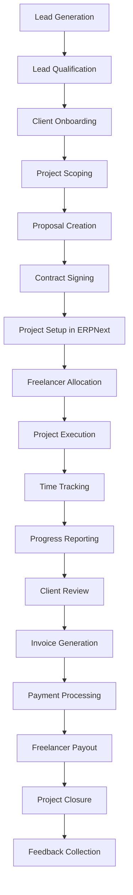
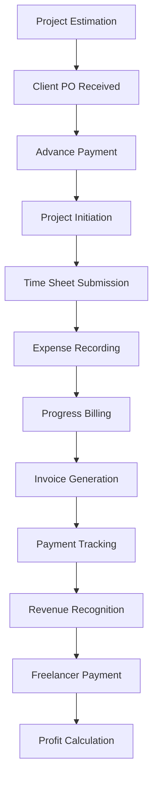

# ERPNext Master Data & Workflow for a Freelance Community

## 🏢 Core System & Administration Data

### Company Setup
- **Company**: BUDE Global Enterprise
- **Company Abbreviation**: BUDE
- **Default Currency**: INR (Indian Rupee)
- **Country**: India
- **Fiscal Year**: April 1 - March 31
- **Tax ID**: GSTIN Number
- **Bank Account Details**: Primary operating account

### User Roles & Permissions
```
Admin → Full system access
Freelancer Manager → Project allocation, freelancer management
Finance Manager → Invoicing, payments, reporting
Client Manager → Client onboarding, relationship management
Freelancer → Time logging, task updates, limited project view
Client → Portal access to project status and invoices
```

### System Settings
- **Date Format**: DD-MM-YYYY
- **Time Format**: 24-hour
- **Number Format**: Indian numbering system
- **Default Language**: English
- **Enable Client Portal**: Yes
- **Enable Supplier Portal**: Yes (for freelancers)

## 💼 Services & Item Master Data

### Service Categories
```
1. Web Development
2. Mobile App Development  
3. UI/UX Design
4. Content Writing
5. Digital Marketing
6. Data Analytics
7. QA Testing
8. DevOps Services
```

### Detailed Service Items
| Item Code | Item Name | Item Group | UoM | Standard Rate | Description |
|-----------|-----------|------------|-----|---------------|-------------|
| SVC-WEB-FRONT | Frontend Development | Web Development | Hour | ₹1,200 | React, Angular, Vue.js development |
| SVC-WEB-BACK | Backend Development | Web Development | Hour | ₹1,500 | Node.js, Python, Java development |
| SVC-MOB-IOS | iOS Development | Mobile Development | Hour | ₹1,800 | Swift, Objective-C development |
| SVC-DES-UI | UI Design | Design | Hour | ₹900 | Figma, Sketch, Adobe XD |
| SVC-CONT-BLOG | Blog Writing | Content | Word | ₹2 | SEO-optimized blog content |
| SVC-MKT-SEO | SEO Services | Marketing | Month | ₹15,000 | Monthly SEO management |


### Pricing Models
- **Hourly Rate**: For ongoing development work
- **Fixed Price**: For well-defined projects
- **Retainer**: Monthly recurring services
- **Per Word**: For content writing
- **Performance-based**: For marketing campaigns

## 🧑‍🤝‍🧑 Client Master Data

### Client Groups
- Enterprise Clients (₹50L+ annual revenue)
- Mid-market Clients (₹10L-50L annual revenue)  
- Startup Clients (<₹10L annual revenue)
- Government Clients
- Non-profit Organizations

### Client Fields
```
Company Name
Industry
Company Size
Billing Address
Shipping Address
GSTIN Number
Payment Terms (Net 15, Net 30, Net 45)
Credit Limit
Preferred Currency
Account Manager
Client Category
Contract Type (Time & Materials, Fixed Price)
Service Level Agreement (SLA) Terms
```

### Client Status Workflow

Prospect → Active → Inactive → Archived


## 🤝 Freelancer Master Data

### Freelancer Categories
```
- Full-stack Developers
- Frontend Developers  
- Backend Developers
- Mobile Developers
- UI/UX Designers
- Content Writers
- Digital Marketers
- Data Scientists
- DevOps Engineers
- QA Testers
```
### Freelancer Profile Data
```
Personal Information
Contact Details
Bank Account Details (for payments)
PAN Number
Skills Matrix (Technologies, Tools)
Experience Level (Junior, Mid, Senior)
Hourly Rate Range
Availability Status (Available, Partially Available, Not Available)
Portfolio Links
Certifications
Education Background
Languages Spoken
Timezone/Location
Preferred Project Types
```

### Freelancer Onboarding Process
```
1. Application Received
2. Skill Assessment
3. Technical Interview
4. Profile Verification
5. Agreement Signing
6. System Onboarding
7. Training Completion
8. Active in System
```

## 🗓️ Projects & Activities Master Data

### Project Types
```
- Web Development
- Mobile App Development
- E-commerce Solutions
- CMS Implementation
- API Development
- Design Projects
- Content Projects
- Marketing Campaigns
- Data Analytics
- DevOps Setup
```
### Project Templates
```
Standard Web Project Template
- Requirement Gathering
- UI/UX Design
- Frontend Development
- Backend Development
- Testing
- Deployment
- Maintenance

Content Project Template  
- Topic Research
- Outline Creation
- Draft Writing
- Editing
- SEO Optimization
- Publishing

Marketing Campaign Template
- Strategy Development
- Content Creation
- Channel Setup
- Execution
- Monitoring
- Reporting
```

### Activity Types
```
Client Meetings
Requirement Analysis
Design Work
Development Work
Code Review
Testing
Deployment
Documentation
Training
Support
```

## 👨‍💼 Human Resources Master Data

### Employee Roles
- Community Manager
- Project Manager
- Quality Assurance Manager
- Client Relationship Manager
- Finance Executive
- Technical Lead

### Designation Hierarchy
```
CEO
CTO
Head of Operations
Project Manager
Team Lead
Senior Developer
Developer
Trainee
```

### Department Structure
```
Management
Operations
Sales & Marketing
Finance
Human Resources
Technical
Creative
```

## 🔄 Comprehensive Workflow Process

### Lead to Cash Process


### Project Execution Workflow


### Financial Workflow


## ⚙️ Automation Rules

### Automatic Actions
- Auto-create tasks from project templates
- Auto-assign tasks based on freelancer skills
- Auto-send reminders for timesheet submission
- Auto-generate invoices on milestone completion
- Auto-send payment reminders to clients
- Auto-calculate freelancer payments
- Auto-update project status based on task completion
- Auto-generate performance reports

### Notification Triggers
```
Project assigned → Notify freelancer
Timesheet submitted → Notify project manager
Invoice generated → Notify client and finance
Payment received → Notify project team
Milestone achieved → Notify all stakeholders
Project delayed → Alert management
Client feedback received → Notify relevant team
```

## 📊 Reporting & Analytics

### Key Performance Indicators
- **Financial Metrics**: Revenue, Profit Margin, Utilization Rate
- **Client Metrics**: Client Satisfaction, Retention Rate, Growth
- **Project Metrics**: On-time Delivery, Budget Adherence, Quality Scores
- **Freelancer Metrics**: Availability, Performance Rating, Skill Development
- **Operational Metrics**: Response Time, Resolution Time, Efficiency

### Standard Reports
```
Monthly Revenue Report
Project Profitability Analysis
Freelancer Performance Dashboard
Client Satisfaction Report
Resource Utilization Report
Accounts Receivable Aging
Expense Tracking Report
Skill Gap Analysis
Project Timeline Adherence
Quality Metrics Report
```

## 🔐 Security & Compliance

### Data Access Controls
- Role-based access to sensitive information
- Client data isolation between projects
- Freelancer access limited to assigned projects
- Financial data restricted to finance team
- HR data accessible only to HR department

### Compliance Requirements
- GST compliance for Indian transactions
- TDS deduction for freelancer payments
- Contract enforcement with clients and freelancers
- Data privacy compliance (GDPR for international clients)
- Audit trail maintenance for all transactions